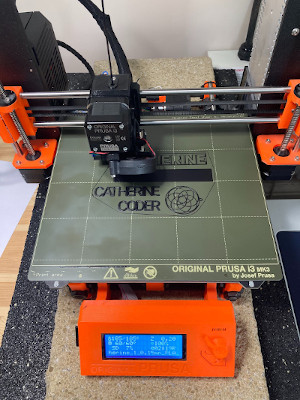

# Code Club

## 3D projects

First, make the 3D coder keyring  project from the [code club site](https://projects.raspberrypi.org/en/projects?software[]=blockscad)

Next you can make you own design of key ring, which we will 3D print. You might like to make one with your name, or you may have another idea - it's up to you. You could make:

* A key ring with just letters like the example.
* A key ring with raised letters.
* A key ring with cut out letters.

The best design will depend on the letters in your design and the font you choose.

Your key ring will be printed on a 3D printer.

