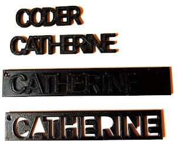

#Raised Letter Keyring

To make the raised letter keyring, start with the letters as in the example 'CODER' project, but this time, leave space between them.

Increase the thickness of the letters to 5.

To make the base, use a cube. The Z size is the height, set this to 3. Adjust the X and Y to fit your letters.

You will need to make a hole to attach the key chain. The hole is a small cylinder, and to cut it out you will need a 'difference' block from the 'Set Ops' menu.
